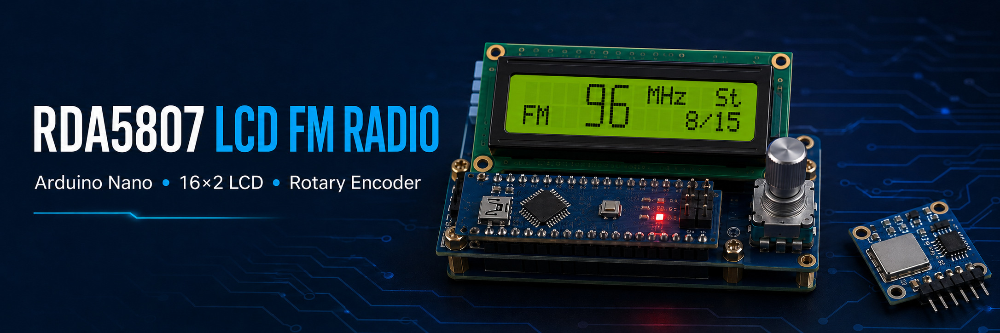

<p align="center">
  
</p>

# RDA5807 LCD FM Radio

An Arduino Nano FM receiver with an RDA5807 module, a 16×2 I2C LCD, and a
rotary encoder. The display uses custom HD44780 characters to show the tuned
frequency in large digits, together with stereo status and signal strength.

## Features

- FM tuning from 86.0 to 108.0 MHz in 0.1 MHz steps
- Rotary-encoder tuning
- Large frequency digits on a 16×2 character LCD
- Stereo indicator on the LCD and Arduino built-in LED
- Seven-level received-signal bar
- Safe frequency limits before commands are sent to the tuner
- Lightweight implementation for the Arduino Nano

## Hardware

- Arduino Nano (ATmega328P)
- RDA5807 or RDA5807M FM receiver module
- 16×2 HD44780-compatible LCD with I2C backpack
- Rotary encoder
- FM antenna
- Jumper wires and a suitable power supply

## Wiring

Both the LCD and radio share the Arduino Nano I2C bus.

| Device | Device pin | Arduino Nano |
|---|---|---|
| I2C LCD | GND | GND |
| I2C LCD | VCC | 5V |
| I2C LCD | SDA | A4 |
| I2C LCD | SCL | A5 |
| RDA5807 | GND | GND |
| RDA5807 | VCC | 3.3V |
| RDA5807 | SDA | A4 |
| RDA5807 | SCL | A5 |
| Rotary encoder | A / Data | D2 |
| Rotary encoder | B / Clock | D3 |
| Rotary encoder | SW | D4, currently unused |
| Rotary encoder | VCC | 3.3V |
| Rotary encoder | GND | GND |

> Verify the voltage requirements printed on your LCD backpack and RDA5807
> module before connecting power. The RDA5807 is a 3.3 V device.

See the [connection diagram](docs/CONNECTIONS.md) for additional notes.

## Required libraries

Install these libraries through the Arduino IDE Library Manager:

- `LiquidCrystal_I2C`
- `Rotary`
- `Radio` by Matthias Hertel, which provides `RDA5807M.h`

The project was originally developed with Arduino IDE 1.8.19.

## Installation

1. Download or clone this repository.
2. Open `firmware/RDA5807_LCD_FM/RDA5807_LCD_FM.ino` in the Arduino IDE.
3. Keep `Bigfonte.h` in that same sketch folder.
4. Install the required libraries.
5. Select **Arduino Nano** and the correct processor/bootloader option.
6. Compile and upload the sketch.

If the LCD backlight turns on but no text appears, check its I2C address. The
default address in the sketch is `0x3F`; many backpacks use `0x27`.

## Configuration

The main settings are grouped near the top of
`firmware/RDA5807_LCD_FM/RDA5807_LCD_FM.ino`:

```cpp
constexpr uint8_t LCD_ADDRESS = 0x3F;
constexpr uint16_t MIN_FREQUENCY = 860;
constexpr uint16_t MAX_FREQUENCY = 1080;
constexpr uint16_t INITIAL_FREQUENCY = 999;
constexpr uint8_t INITIAL_VOLUME = 15;
```

Frequencies are stored in tenths of MHz, so `999` represents 99.9 MHz.

## Project structure

```text
RDA5807-LCD/
├── README.md
├── CHANGELOG.md
├── CONTRIBUTING.md
├── LICENSE
├── firmware/
│   └── RDA5807_LCD_FM/
│       ├── RDA5807_LCD_FM.ino
│       └── Bigfonte.h
└── docs/
    ├── CONNECTIONS.md
    └── images/
        ├── banner.png
        └── wiring-diagram.svg
```

## Credits

- Project and integration: Anderson Cardoso da Silva
- Original large-number LCD implementation: Fabiano A. Arndt
- Radio library: Matthias Hertel

## License

This project is available under the [MIT License](LICENSE). Third-party
libraries remain subject to their respective licenses.
