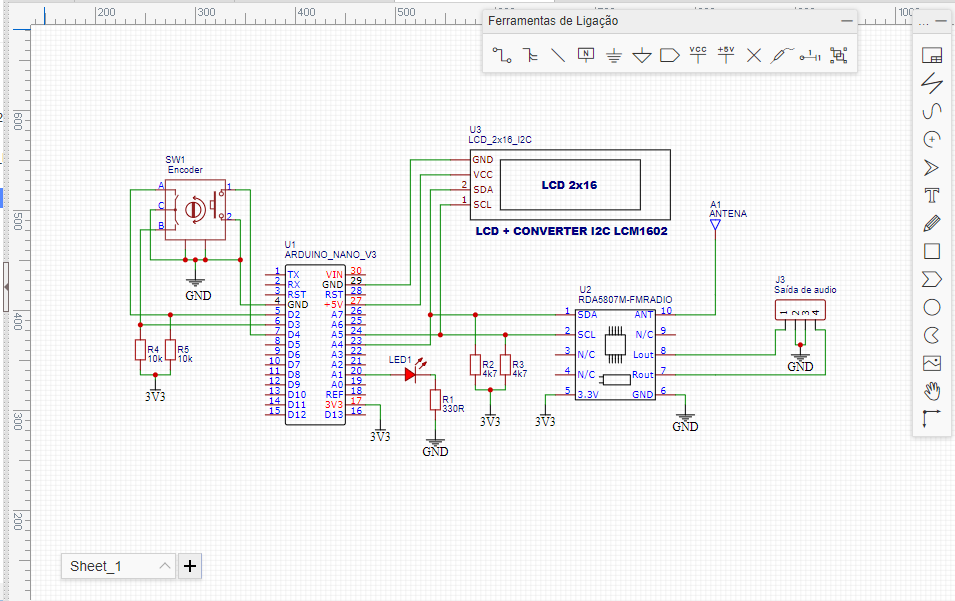
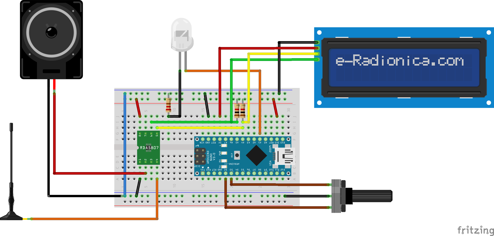

# Connections and assembly

## I2C bus

The Arduino Nano uses A4 for SDA and A5 for SCL. The 16×2 LCD backpack and
RDA5807 module are connected in parallel to these two lines.

## Rotary encoder

Encoder outputs A and B are connected to D2 and D3. The sketch handles both
pins through the ATmega328P pin-change interrupt system. The encoder switch can
be connected to D4 for a future feature, but the current sketch does not read
it.

## Stereo indicator

The built-in LED on D13 follows the stereo state reported by the RDA5807. A
block character in the upper-right corner of the LCD provides the same status.

## Power and logic levels

- Power the RDA5807 module from 3.3 V.
- Confirm the rated voltage of the rotary encoder module before connecting it.
- Many I2C LCD backpacks are powered from 5 V and may pull SDA/SCL up to 5 V.
  Check the specific RDA5807 breakout board before sharing the bus. Use a
  bidirectional I2C level shifter when the module does not include level
  conversion or 5 V-tolerant bus protection.
- Connect all grounds together.
- Add an antenna appropriate for the receiver module.

## Diagram

The diagram is a logical wiring reference. Always verify the pin labels on the
specific modules being used.

## Fritzing

